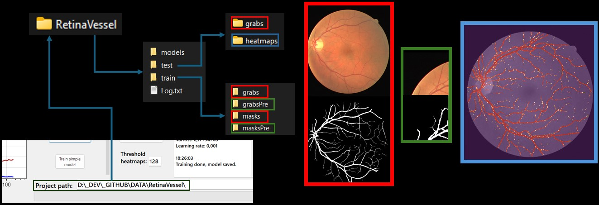
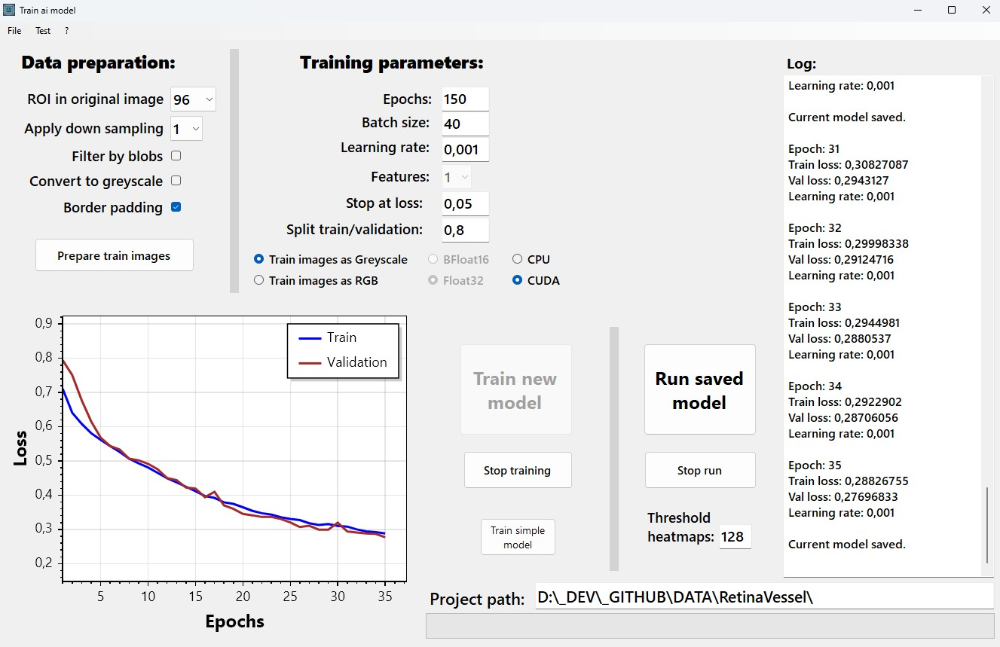

# Ai with C#

** Under early development**

Train and run models in C# with [TorchSharp](https://github.com/dotnet/TorchSharp).

First model implementation is a UNet model (with BatchNorm2d).

  
## Usage

The TrainAiModel WinForms application expects a folder structure as follows

DATA.zip is included where everything has been setup correctly.

You can set some parameters in the GUI

## Typical workflow

1. Copy images and masks into the grabs/masks folder (matching files need to have the same file names)
2. Set parameters in "Data preperation" and click on "Prepare train images" button -> images are saved into the grabsPre/masksPre folders
3. Set up "Training parameters"
4. Click on "Train new model" -> images in grabsPre/masksPre are being trained
5. Model and settings are saved in the models folder
6. By clicking on "Run saved model" button all images in the test\grabs folder are run by the model and results are saved into the test\heatmaps folder

The RunAiModel application is just for testing purposes.

## ToDos

- Refactor model to sequential
- More loss functions
- DataAugmentations
- Calculate batch size by estimating memory requirement
- Add BFloat16 as soon as .NET 9 is out
