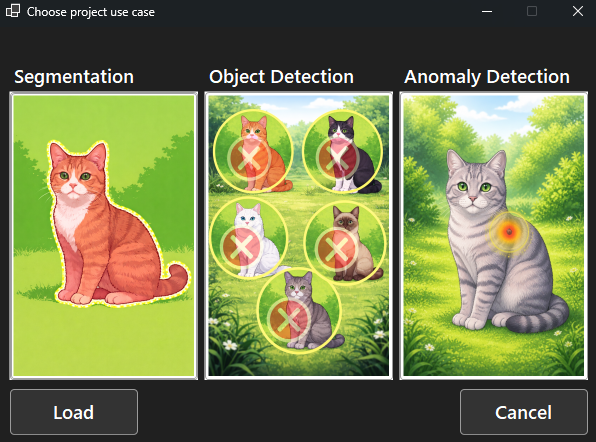
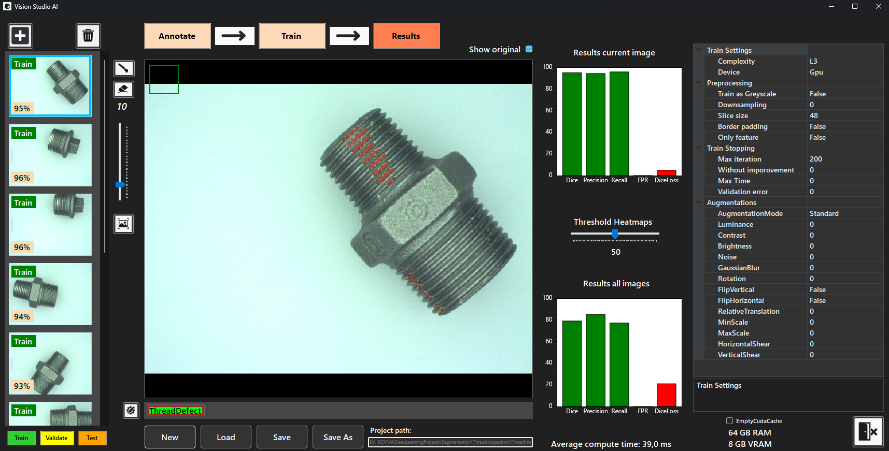
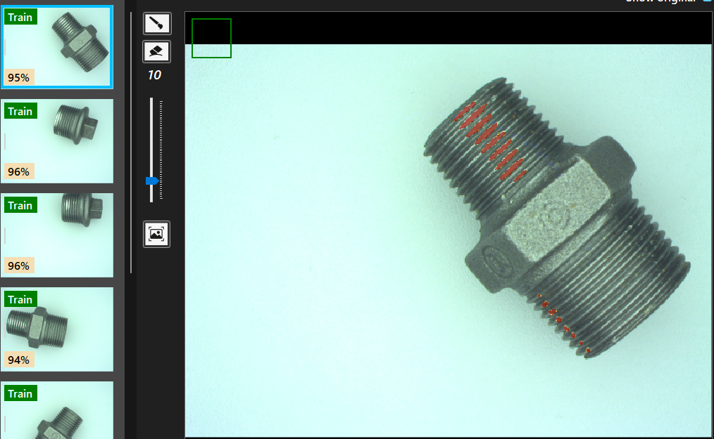
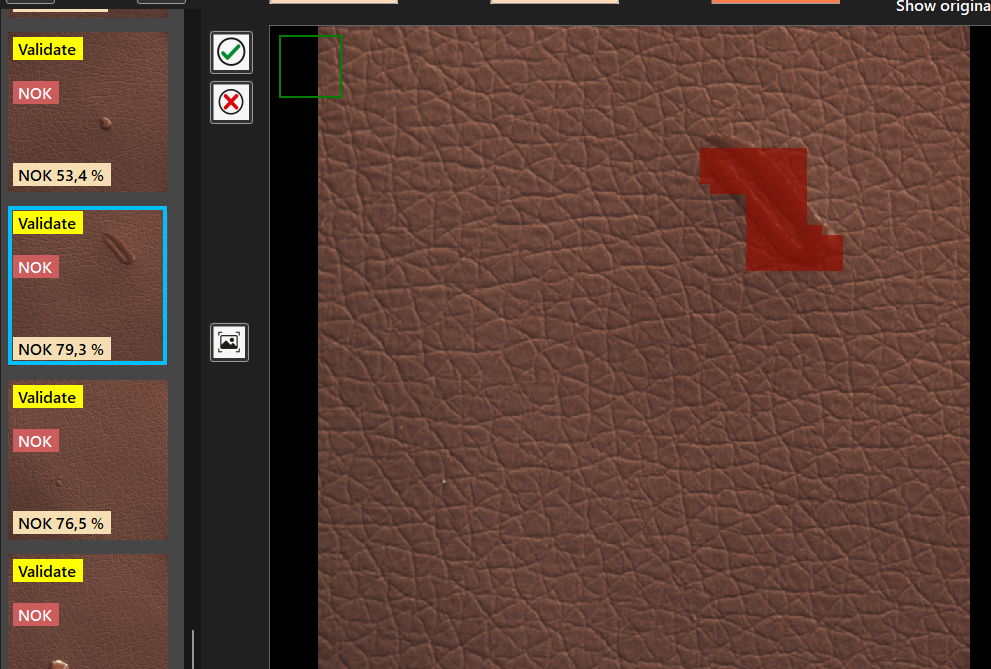
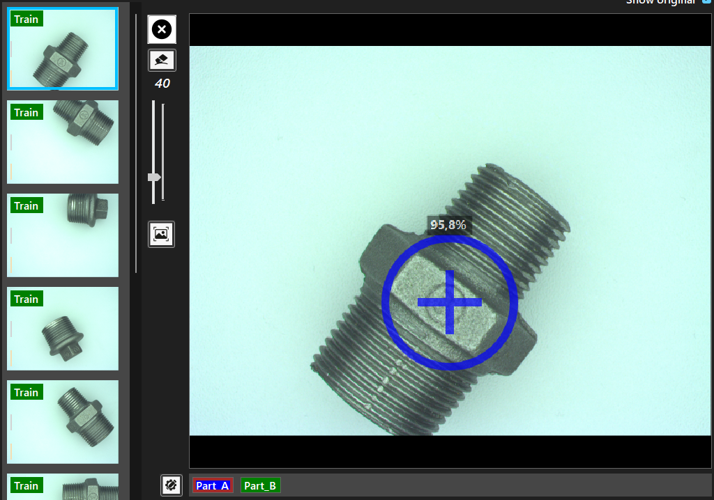

# VisionStudioAI

VisionStudioAI is a Windows desktop application, machine-learning library, and .NET inference SDK for experimenting with end-to-end industrial vision workflows in C#.

The goal is to make common inspection tasks approachable without requiring users to design neural-network architectures themselves. A user creates a project, imports images, supplies the annotations appropriate for the task, selects a model-complexity level, trains a model, runs inference, and inspects the visual and numerical results from one application.

> **Project status:** VisionStudioAI is a proof of principle and an active development project. It demonstrates that useful industrial vision models can be annotated, trained, evaluated, and executed with C# and TorchSharp. It is not yet a validated, production-ready inspection system.






## Supported workflows

| Workflow | Annotation | Current model approach | Inference output |
| --- | --- | --- | --- |
| Segmentation | Pixel masks drawn with brush and eraser tools | Configurable U-Net and U-Net++ family models | Per-class probability heatmaps, masks, and segmentation metrics |
| Object detection | Object center, class, and expected diameter | Heatmap model using the segmentation backbone, followed by connected-component center extraction | Object centers, classes, confidence values, and heatmaps |
| Anomaly detection | Image-level OK/NOK labels; no defect masks required | OK-only self-supervised ResNet-18 feature learning with CutPaste and a nearest-neighbour memory bank | Image anomaly score, OK/NOK prediction, and one general anomaly heatmap |

### Segmentation

Segmentation supports binary and multiclass projects. Images can contain small defects such as cracks, scratches, pores, particles, or other pixel-level features.

The user-facing complexity levels `L0` through `L5` are translated into complete model configurations. Lower levels create conservative U-Net models for small datasets; higher levels add capacity and can select U-Net++ together with residual blocks and attention mechanisms.

### Object detection

Object detection is intended for countable industrial features with an approximately known size. The user places object centers instead of drawing bounding boxes. Training converts these annotations into response maps, and inference extracts object centers from the predicted heatmaps.

This is deliberately different from a general-purpose bounding-box detector such as YOLO. It fits controlled inspection tasks such as finding parts, holes, particles, or repeated features with a predictable scale.

### Anomaly detection

The current anomaly detector learns only from images marked **OK**. It trains a ResNet-18 feature extractor using synthetic CutPaste pretext examples, builds a memory bank from normal image descriptors, and measures new image patches by their nearest-neighbour distance to normality.

- At least one OK training image and one OK validation image are required.
- NOK validation images are optional and can improve decision-threshold calibration.
- Real NOK images are not passed to the optimizer.
- Pixel annotations and ground-truth masks are not created or required.
- Training can start with random weights or, experimentally, ImageNet-pretrained ResNet-18 weights.
- A `GoldenSample` approach is reserved in the model contract but is not implemented yet.

## Application capabilities

- Project-based dataset management with safe project-local image copies
- Train, validation, and test category assignment
- Per-image ROI selection, zooming, and panning
- Greyscale and RGB training
- Tiled preprocessing and full-image result reconstruction
- Configurable slice size, downsampling, padding, and normalization
- Image augmentation for brightness, contrast, luminance, noise, blur, rotation, translation, scaling, shear, and flipping
- User-friendly `L0`-`L5` model-complexity presets
- CPU and NVIDIA CUDA training and inference
- CPU/GPU memory-aware batch-size estimation
- Training logs, progress display, loss curves, stopping settings, and cancellation
- Saved model artifacts and model selection for later inference
- Per-image and combined result plots
- Segmentation quality statistics such as Dice, precision, recall, and false-positive rate
- Anomaly accuracy, precision, recall, F1, false-positive rate, scores, labels, and heatmaps
- xUnit coverage for core model, preprocessing, inference, persistence, and stability behavior

## Typical workflow

```text
Create project
    -> Import images
    -> Select ROI and dataset split
    -> Annotate masks/objects or mark images OK/NOK
    -> Configure preprocessing and model complexity
    -> Train
    -> Select a trained model
    -> Run inference
    -> Inspect heatmaps, predictions, metrics, and compute time
```

The application is primarily designed for controlled industrial environments where cameras, lighting, backgrounds, part position, and image appearance have less variation than general real-world computer-vision datasets.

## Sample projects

Ready-to-use sample projects are included in the [`SampleProjects`](SampleProjects/) directory. Each example is stored as a self-contained project folder with its JSON file, images, annotations, settings, and optional results.

```text
SampleProjects/
├── AnomalyDetection/
│   └── LeatherInspection/
├── ObjectDetection/
│   └── ObjectDetectionTest/
└── Segmentation/
    └── ThreadInspection/
```

The currently included examples are:

### Segmentation



### Anomaly Detection



### Object Detection



To use a sample, download or clone the repository, extract the archive, and open the extracted project JSON file from VisionStudioAI. The sample archives are currently kept directly in the repository.

## Solution structure

```text
src/
  VisionStudioAI.App/    WinForms annotation, training, and inference application
  VisionStudioAI.Core/   Project model, persistence, runtime image state, and interaction logic
  VisionStudioAI.ML/     TorchSharp models, preprocessing, training, inference, and postprocessing
  VisionStudioAI.SDK/    Headless segmentation inference API for external .NET applications
  VisionStudioAI.Tests/  xUnit regression and stability tests
  PyBridgeLoader/        Downloads and converts PyTorch ResNet-18 weights for TorchSharp

NativeTorchCudaOps/      Native helper used for explicit CUDA cache clearing
SampleProjects/          Example project data and archives
```

At a high level, the WinForms application coordinates project state from `VisionStudioAI.Core` and training/inference operations from `VisionStudioAI.ML`. The headless SDK reuses the Core and ML libraries without requiring the desktop UI.

## Requirements

- Windows 10 or Windows 11, x64
- .NET 10 SDK
- An IDE with .NET 10 support, or the `dotnet` CLI
- Sufficient system memory for the selected image, tile, batch, and model sizes
- Optional NVIDIA GPU and a driver compatible with the TorchSharp CUDA runtime

The desktop application targets `net10.0-windows10.0.26100.0`. Core, ML, and SDK libraries target `netstandard2.0`.

## Build and run

From the repository root:

```powershell
dotnet restore src/VisionStudioAI.sln
dotnet build src/VisionStudioAI.sln
dotnet run --project src/VisionStudioAI.App/VisionStudioAI.App.csproj
```

Run the test suite with:

```powershell
dotnet test src/VisionStudioAI.Tests/VisionStudioAI.Tests.csproj
```

After starting the application:

1. Choose segmentation, object detection, or anomaly detection.
2. Create a project and add images.
3. Assign images to the train, validation, or test split.
4. Add the annotations required by the selected workflow.
5. Configure preprocessing, augmentations, stopping rules, compute device, and model complexity.
6. Train and save a model.
7. Select the trained model and run inference on the project images.
8. Inspect heatmaps, predictions, statistics, and inference time.

## Optional pretrained anomaly weights

Anomaly models can be trained completely from scratch. An experimental pretrained path is also available for initializing the ResNet-18 backbone with ImageNet-1K V1 weights.

Run the conversion utility to download the official PyTorch checkpoint, verify its SHA-256 hash, load it through TorchSharp.PyBridge, and save it in TorchSharp's native format:

```powershell
dotnet run --project src/PyBridgeLoader/PyBridgeLoader.csproj
```

The generated file is:

```text
src/PyBridgeLoader/models/resnet18/resnet18-imagenet1k-v1.dat
```

The app project copies this file into its output directory. Pretrained anomaly initialization is currently controlled by the `UsePretrainedAnomalyWeights` constant in `MainForm.cs`; it is not yet exposed as a normal UI setting.

## Segmentation SDK

`VisionStudioAI.SDK` provides headless segmentation inference for integration into another .NET application. A loaded session should be reused for multiple images and must not be called concurrently.

```csharp
using OpenCvSharp;
using VisionStudioAI.SDK;

using var session = SegmentationInferenceSession.Load(
    modelPath: "model.bin",
    settingsJsonPath: "settings.json",
    device: InferenceDevice.Cpu); // or InferenceDevice.Cuda

using var image = Cv2.ImRead("image.png");
var result = session.Run(image);

foreach (var prediction in result)
{
    int classId = prediction.Key;
    Mat probabilityMask = prediction.Value;

    // Use the full-resolution probability mask, then release it.
    probabilityMask.Dispose();
}
```

The returned value is an `IReadOnlyDictionary<int, Mat>`:

- Key: feature class ID; background is implicit.
- Value: full-resolution floating-point probability mask.

The SDK also accepts `Bitmap` and `CogImageBuffer` inputs. Dedicated object-detection and anomaly-detection SDK sessions have not yet been exposed.

## CUDA cache helper

`NativeTorchCudaOps.dll` is used by `NativeTorchCudaOps.EmptyCudaCache()` for optional explicit CUDA cache clearing. The native helper must match the TorchSharp/libtorch/CUDA dependencies used by the application. The current helper targets TorchSharp `0.105.2`; it may need to be rebuilt after dependency updates.

The desktop application includes a checkbox that enables or disables explicit CUDA cache clearing.

## Current limitations

VisionStudioAI should currently be treated as an engineering prototype. In particular:

- Models and thresholds must be validated on representative images from the target camera, optics, lighting, materials, and production process.
- The project and model artifact formats do not yet provide a formal compatibility or migration guarantee.
- GPU batch-size estimation is heuristic and cannot guarantee a particular VRAM utilization on every GPU or workload.
- Live image import is temporarily limited to 250 images per operation while the thumbnail grid awaits paging or virtualization.
- The anomaly pretrained-weight option is currently a source-code flag.
- Golden-sample anomaly detection is planned but not implemented.
- The public headless SDK currently covers segmentation only.
- Deployment packaging, long-running reliability, recovery behavior, security hardening, performance qualification, and production monitoring still require further work.
- Results must not be used for safety-critical or quality-critical decisions without application-specific validation and appropriate fallback procedures.

Despite these limitations, the repository is a practical demonstration of building an industrial AI vision workflow almost entirely in C#: dataset handling, annotation, TorchSharp model training, inference, visualization, and external .NET integration.

## License

VisionStudioAI is licensed under the [Apache License 2.0](LICENSE.txt).
